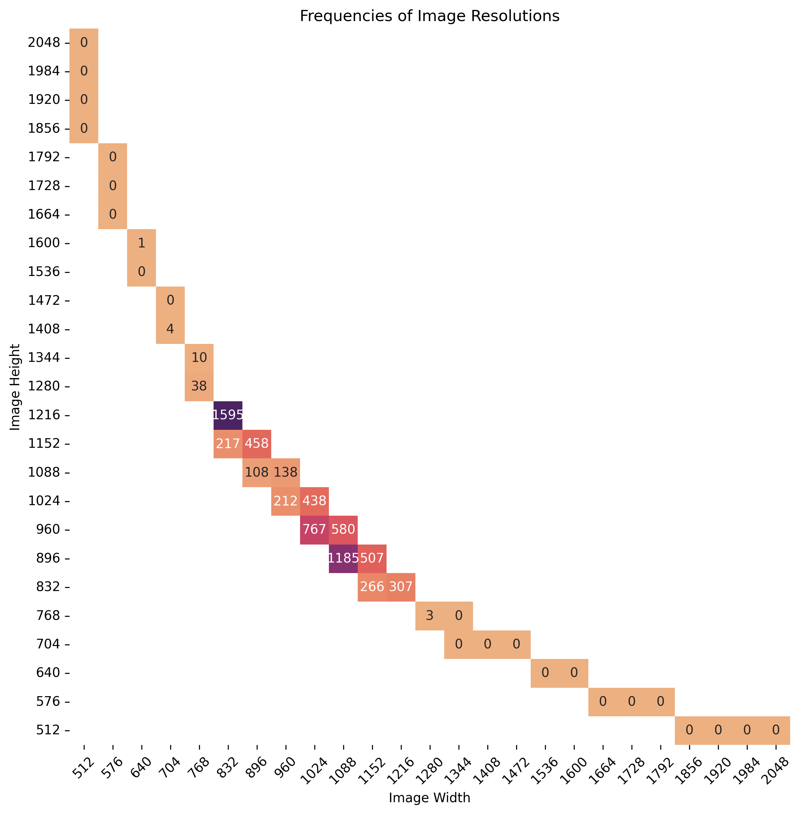

# Flickr-Portraits-XL Dataset (FPXL) 

This is a cropped and resized subset of [FFHQ](https://github.com/NVlabs/ffhq-dataset). The image resolutions are the same as [SDXL](https://arxiv.org/abs/2307.01952) mixed-aspect ratio finetuning as indicated in Appendix I. 

Enumeration of images is the same as FFHQ. This enables usage of supporting datasets/libraries such as [DCGM/ffhq-features-dataset](https://github.com/DCGM/ffhq-features-dataset)

More information of the images can be obtained via [ffhq-dataset-v2.json](https://github.com/NVlabs/ffhq-dataset?tab=readme-ov-file#overview) provided by FFHQ.

## Image Resolutions. 

## Acknowledgements

Thank you to the authors of the FFHQ dataset.

## Licenses

The individual images were published in Flickr by their respective authors under either [Creative Commons BY 2.0](https://creativecommons.org/licenses/by/2.0/), [Creative Commons BY-NC 2.0](https://creativecommons.org/licenses/by-nc/2.0/), [Public Domain Mark 1.0](https://creativecommons.org/publicdomain/mark/1.0/), [Public Domain CC0 1.0](https://creativecommons.org/publicdomain/zero/1.0/), or [U.S. Government Works](http://www.usa.gov/copyright.shtml) license. All of these licenses allow **free use, redistribution, and adaptation for non-commercial purposes**. However, some of them require giving **appropriate credit** to the original author, as well as **indicating any changes** that were made to the images. The license and original author of each image are indicated in the metadata.

* [https://creativecommons.org/licenses/by/2.0/](https://creativecommons.org/licenses/by/2.0/)
* [https://creativecommons.org/licenses/by-nc/2.0/](https://creativecommons.org/licenses/by-nc/2.0/)
* [https://creativecommons.org/publicdomain/mark/1.0/](https://creativecommons.org/publicdomain/mark/1.0/)
* [https://creativecommons.org/publicdomain/zero/1.0/](https://creativecommons.org/publicdomain/zero/1.0/)
* [http://www.usa.gov/copyright.shtml](http://www.usa.gov/copyright.shtml)

The dataset itself (including JSON metadata, download script, and documentation) is made available under [Creative Commons BY-NC-SA 4.0](https://creativecommons.org/licenses/by-nc-sa/4.0/) license by NVIDIA Corporation. You can **use, redistribute, and adapt it for non-commercial purposes**, as long as you (a) give appropriate credit by **citing our paper**, (b) **indicate any changes** that you've made, and (c) distribute any derivative works **under the same license**.

* [https://creativecommons.org/licenses/by-nc-sa/4.0/](https://creativecommons.org/licenses/by-nc-sa/4.0/)

