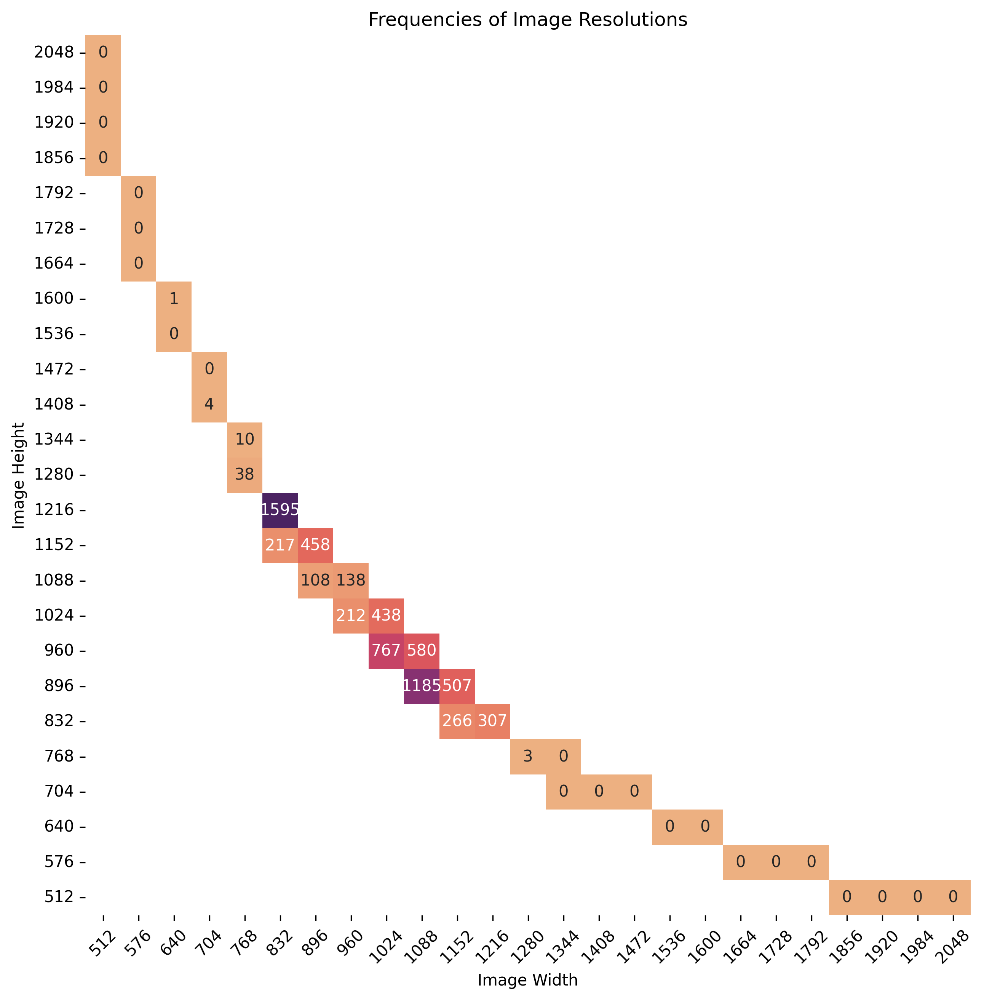

# Flickr-Portraits-XL Dataset (FPXL) 


This dataset is a **cropped and resized subset of the [FFHQ dataset](https://github.com/NVlabs/ffhq-dataset)**, featuring high-quality facial images tailored for advanced computer vision tasks. The images maintain the same resolution specifications as the **[SDXL model](https://arxiv.org/abs/2307.01952)** mixed-aspect ratio finetuning (approximately **1 megapixel**).

Image enumeration follows the original **FFHQ numbering scheme**, allowing seamless integration with related datasets and tools such as the **[DCGM/ffhq-features-dataset](https://github.com/DCGM/ffhq-features-dataset)**.

The dataset curation process includes:  
- Filtering with **MTCNN face detection** to ensure accurate face localization.  
- Performing precise **face alignment** to standardize facial orientation.  
- Cropping images to center the face horizontally and position it at approximately **1/3 from the top vertically** for consistent framing.  
- Standardizing image resolutions to conform with **SDXL model requirements (~1 megapixel)**, optimizing compatibility for portrait generation, facial recognition, and synthetic data augmentation research.

For more detailed metadata and image information, refer to the **[ffhq-dataset-v2.json](https://github.com/NVlabs/ffhq-dataset?tab=readme-ov-file#overview)** provided by FFHQ.

## Image Resolutions


All images are processed to match **SDXL training specifications** (~1MP):




## Acknowledgements

Thank you to the authors of the FFHQ dataset.


## Citation (BibTeX)

If you use the FPXL dataset in your research, please cite:

```bibtex
@inproceedings{Ulusan2025SynData4CV,  
  author        = {Ulusan, Koray and Kiefer, Benjamin},
  title         = {{Generating Synthetic Data via Augmentations for Improved Facial Resemblance in DreamBooth and InstantID}},
  booktitle     = {Proceedings of the CVPR 2025 Workshop on Synthetic Data for Computer Vision (SynData4CV)},
  year          = {2025},
  month         = {May},
  url           = {https://openreview.net/forum?id=2o0RxrcV23},
  note          = {Accepted to the CVPR 2025 SynData4CV Workshop},
  eprint        = {2505.03557},
  archiveprefix = {arXiv},
  primaryclass  = {cs.CV},
  doi           = {10.48550/arXiv.2505.03557}
}
```

## Licenses

The individual images were published in Flickr by their respective authors under either [Creative Commons BY 2.0](https://creativecommons.org/licenses/by/2.0/), [Creative Commons BY-NC 2.0](https://creativecommons.org/licenses/by-nc/2.0/), [Public Domain Mark 1.0](https://creativecommons.org/publicdomain/mark/1.0/), [Public Domain CC0 1.0](https://creativecommons.org/publicdomain/zero/1.0/), or [U.S. Government Works](http://www.usa.gov/copyright.shtml) license. All of these licenses allow **free use, redistribution, and adaptation for non-commercial purposes**. However, some of them require giving **appropriate credit** to the original author, as well as **indicating any changes** that were made to the images. The license and original author of each image are indicated in the metadata.

* [https://creativecommons.org/licenses/by/2.0/](https://creativecommons.org/licenses/by/2.0/)
* [https://creativecommons.org/licenses/by-nc/2.0/](https://creativecommons.org/licenses/by-nc/2.0/)
* [https://creativecommons.org/publicdomain/mark/1.0/](https://creativecommons.org/publicdomain/mark/1.0/)
* [https://creativecommons.org/publicdomain/zero/1.0/](https://creativecommons.org/publicdomain/zero/1.0/)
* [http://www.usa.gov/copyright.shtml](http://www.usa.gov/copyright.shtml)

The dataset itself (including JSON metadata, download script, and documentation) is made available under [Creative Commons BY-NC-SA 4.0](https://creativecommons.org/licenses/by-nc-sa/4.0/) license by NVIDIA Corporation. You can **use, redistribute, and adapt it for non-commercial purposes**, as long as you (a) give appropriate credit by **citing our paper**, (b) **indicate any changes** that you've made, and (c) distribute any derivative works **under the same license**.

* [https://creativecommons.org/licenses/by-nc-sa/4.0/](https://creativecommons.org/licenses/by-nc-sa/4.0/)


